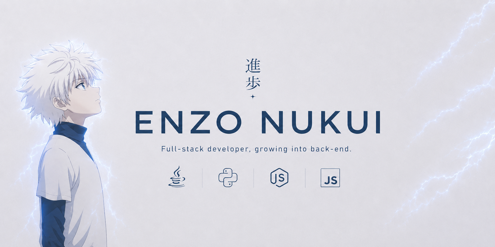

  

<h2 align="center">
  Building through errors and learning through failures, 
  until the progress speaks for itself.
</h2>

  ADS Student • Full-stack in progress • Growing into back-end

---
About
I'm currently studying Análise e Desenvolvimento de Sistemas and building my path through real projects, practice and continuous improvement.
I like turning ideas into functional projects while learning the tools, logic and structure behind software development.
---
Education & Learning
Análise e Desenvolvimento de Sistemas  
FIAP • Expected graduation: 2027
Administração  
IFSP • Technical background in management, organization and business fundamentals
Cambridge English Certificate  
English certification focused on communication and language skills
Beyond college, I study through courses, documentation and personal projects, learning by turning ideas into real applications.
---
Currently Studying
Java and Object-Oriented Programming
Python for logic, automation and data handling
SQL and database fundamentals
HTML, CSS and JavaScript
Artificial Intelligence fundamentals
Git, GitHub and project documentation
---
Tech Stack
Front-end

  
  
  

Back-end & Programming

  
  
  

Database

  
  

Tools

  
  
  
  

Currently Exploring

  
  
  

---
GitHub Stats

  

---
Contact

  
  
  

