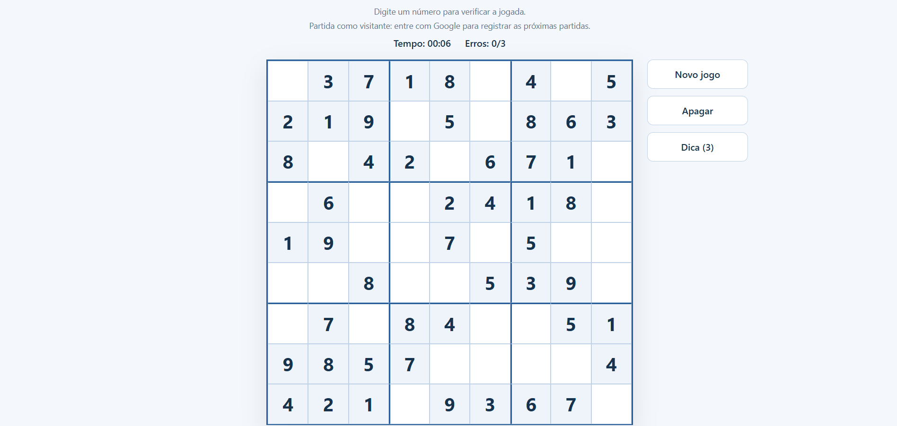
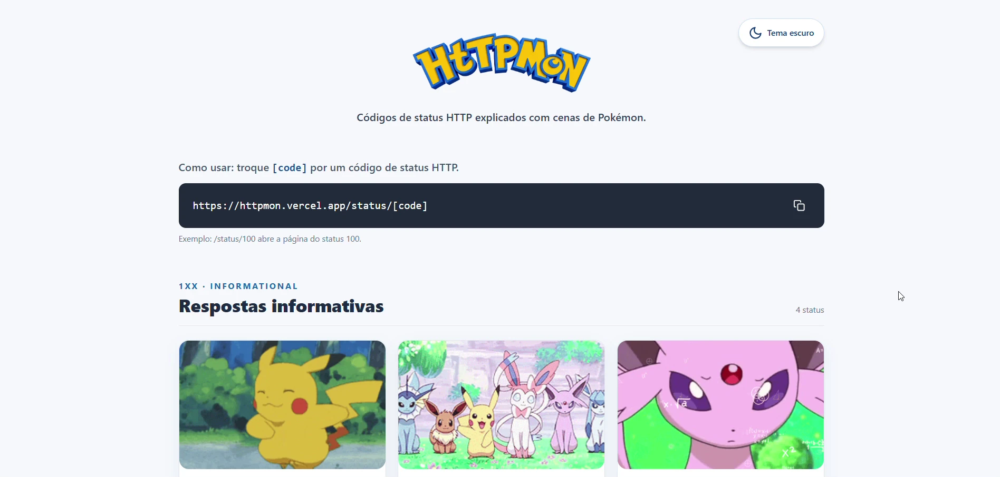
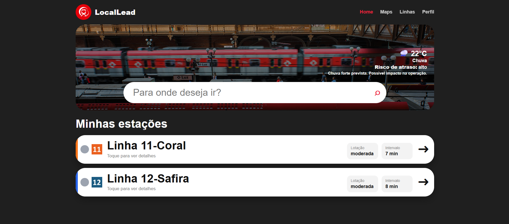
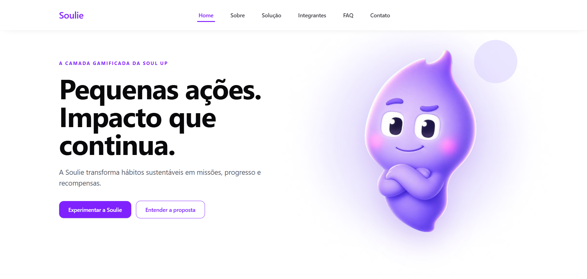

  

[Português](./README.md) | [English](./README.en.md)

 

<em>"Nobody asked for what you're building. Build it anyway."</em>

---

## Sobre mim

Olá, eu sou o Enzo 👋

Curso **Análise e Desenvolvimento de Sistemas na FIAP** e venho direcionando meus estudos para desenvolvimento de software.

Gosto de transformar o que aprendo em projetos que realmente funcionam. Por isso, grande parte da minha evolução aconteceu construindo aplicações completas, conectando interface, lógica de negócio, APIs e bancos de dados.

Hoje trabalho principalmente com **Java, Python, React e TypeScript**, além de SQL e bancos relacionais. Tenho interesse tanto em back-end quanto em front-end e busco entender como todas as partes de uma aplicação se conectam.

---

## Tecnologias

<table align="center">
  <tr>
    <td align="center" width="25%">
      <strong>Front-end</strong>
        
      
    </td>
    <td align="center" width="25%">
      <strong>Back-end</strong>
        
      
    </td>
    <td align="center" width="25%">
      <strong>Banco de Dados</strong>
        
      
      
       
      Oracle Database · MySQL · SQL
    </td>
    <td align="center" width="25%">
      <strong>Ferramentas</strong>
        
      
    </td>
  </tr>
</table>

 

  
    APIs REST · JDBC · MVC · POO · Bancos Relacionais · Git/GitHub
  

---

## Projetos em destaque

### [Sudoku](https://github.com/EnzoNukui/sudoku)

  

`Projeto pessoal` `Full Stack` `Aplicação publicada`

**Projeto:** aplicação web de Sudoku que evoluiu de uma versão em Python no terminal para uma solução completa com geração dinâmica de partidas, autenticação e ranking.

**Destaques técnicos:** API REST com FastAPI, lógica de geração por backtracking, integração entre React e Python, autenticação com Google e persistência de usuários e partidas no Oracle Database.

[**Repositório**](https://github.com/EnzoNukui/sudoku) · [**Ver aplicação**](https://ende-sudoku.vercel.app/)

---

### [HTTPmon](https://github.com/EnzoNukui/HTTPmon)

  

`Projeto pessoal` `Front-end` `Aplicação publicada`

**Projeto:** plataforma visual para explorar códigos de status HTTP através de explicações, exemplos práticos e referências ao universo Pokémon.

**Destaques técnicos:** catálogo tipado de status HTTP, componentes reutilizáveis, rotas dinâmicas para cada código e interface responsiva construída a partir de uma única estrutura de página.

[**Repositório**](https://github.com/EnzoNukui/HTTPmon) · [**Ver aplicação**](https://httpmon.vercel.app/)

---

### [LocalLead](https://github.com/EnzoNukui/LocalLead)

  

`Projeto acadêmico` `Full Stack` `MVP publicado`

**Projeto:** plataforma de mobilidade ferroviária voltada às linhas 11-Coral e 12-Safira, reunindo informações úteis para apoiar decisões antes do embarque.

**Destaques técnicos:** API própria com Node.js e Express, integração com serviços externos, Geolocation API, dados GTFS, estimativas de chegada e funcionamento como PWA.

[**Repositório**](https://github.com/EnzoNukui/LocalLead) · [**Ver aplicação**](https://locallead.vercel.app/)

---

### [Soulie](https://github.com/EnzoNukui/soulie-sprint3)

  

`Projeto acadêmico em equipe` `Front-end` `Aplicação publicada`

**Projeto:** experiência digital desenvolvida para o Challenge FIAP em parceria com a SoulUp, utilizando um avatar interativo para acompanhar a jornada do usuário.

**Destaques técnicos:** aplicação SPA componentizada, navegação com rotas estáticas e dinâmicas, formulários tipados e validados, estados interativos e interface responsiva.

[**Repositório**](https://github.com/EnzoNukui/soulie-sprint3) · [**Ver aplicação**](https://soulie-sprint3.vercel.app/)
## Experiência técnica

Ao longo dos meus projetos, venho trabalhando com diferentes partes do desenvolvimento de software:

- desenvolvimento e consumo de APIs REST
- integração entre front-end, back-end e banco de dados
- Programação Orientada a Objetos
- arquitetura MVC
- integração com banco de dados utilizando JDBC
- autenticação e controle de sessão
- modelagem e persistência de dados
- validações e tratamento de erros
- interfaces responsivas
- testes e documentação
- deploy de aplicações
- desenvolvimento colaborativo utilizando Git e GitHub

---

## GitHub Activity

  

---

## Formação

🎓 **Análise e Desenvolvimento de Sistemas · FIAP**

🌎 **Inglês intermediário B1 · Cambridge English**

---

## Contato

[![
